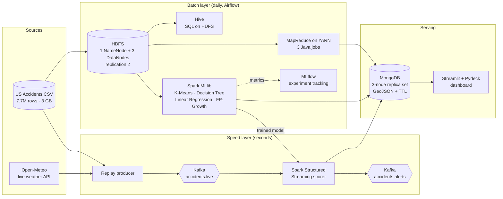

# ARGUS: Complete Project Documentation

**ARGUS: A Lambda-Architecture Framework for Real-Time Road Accident Hotspot Detection and Severity Prediction using Distributed Big Data Technologies**

*Accident Risk Grid & Unified Streaming: "The hundred-eyed guardian of the roads."*

| | |
|---|---|
| **Course** | Big Data Analytics |
| **Repository** | https://github.com/neevmodh/ARGUS |
| **Team members** | _(fill in names / enrollment numbers)_ |
| **Guide** | _(fill in faculty name)_ |
| **Academic year** | 2026–27 |

---

## Table of contents

1. [Abstract](#1-abstract)
2. [Introduction](#2-introduction)
3. [Problem statement](#3-problem-statement)
4. [Objectives](#4-objectives)
5. [Scope](#5-scope)
6. [Syllabus coverage](#6-syllabus-coverage)
7. [Dataset](#7-dataset)
8. [System architecture](#8-system-architecture)
9. [Technology stack](#9-technology-stack)
10. [Module-wise implementation](#10-module-wise-implementation)
11. [Storage reference: HDFS paths and MongoDB collections](#11-storage-reference-hdfs-paths-and-mongodb-collections)
12. [Installation and execution](#12-installation-and-execution)
13. [Command reference](#13-command-reference)
14. [Live demonstrations](#14-live-demonstrations)
15. [Results](#15-results)
16. [Design decisions](#16-design-decisions)
17. [Challenges faced and solutions](#17-challenges-faced-and-solutions)
18. [Limitations](#18-limitations)
19. [Future scope](#19-future-scope)
20. [Team roles](#20-team-roles)
21. [Viva questions and answers](#21-viva-questions-and-answers)
22. [References](#22-references)
23. [Appendix](#23-appendix)

---

## 1. Abstract

Road accidents cause over a million deaths worldwide each year, yet accident data is usually analysed after the fact, in batches, on a single machine. ARGUS is a distributed big data platform that turns 7.7 million historical US accident records (about 3 GB) into **real-time, location-aware risk intelligence**.

ARGUS follows the **Lambda architecture**:

- **Batch layer.** Raw data is stored in **HDFS** on a multi-node Hadoop cluster and aggregated with **Java MapReduce** jobs on **YARN**. It is queried with **Hive** and cleaned into partitioned Parquet with **Apache Spark**. Four **Spark MLlib** models are trained on it: **K-Means** to find accident hotspots, a **Decision Tree** to predict severity, **Linear Regression** to forecast daily accidents, and **FP-Growth** to mine association rules. **NumPy/SciPy** hypothesis tests support the analysis, and every experiment is tracked in **MLflow**.
- **Speed layer.** Accident events are streamed through **Apache Kafka**, enriched with live weather from the **Open-Meteo API**, and scored within seconds by **Spark Structured Streaming** using the trained model.
- **Serving layer.** Results from both layers go to a 3-node **MongoDB replica set** (with GeoJSON and TTL indexes) and are shown on a **Streamlit + Pydeck** 3D map dashboard. **Apache Airflow** runs the batch layer daily.

The project also includes live fault-tolerance demonstrations (a DataNode failure and a MongoDB primary election) and a benchmark comparing MapReduce, Hive, and Spark (RDD, DataFrame, SQL and Parquet) on the same query. Together these cover all five units of the syllabus in one pipeline.

**Keywords:** Big Data, Hadoop, HDFS, MapReduce, YARN, Hive, Apache Spark, MLlib, Kafka, Structured Streaming, MongoDB, CAP Theorem, Lambda Architecture, Road Safety.

---

## 2. Introduction

### 2.1 Background
Traffic accidents are rare, but every one produces data: location, time, weather, road features and severity. Across a whole country, over years, this becomes a classic big data problem:

| V | In ARGUS |
|---|---|
| **Volume** | 7.7 million records, 46 columns, about 3 GB of raw CSV |
| **Velocity** | New accidents arrive continuously and need a response in seconds |
| **Variety** | Structured numbers (temperature, visibility), free text (descriptions), GPS geometry, timestamps, booleans, and live JSON from a weather API |
| **Veracity** | Missing weather readings, inconsistent condition labels (about 140 spellings), duplicate records |
| **Value** | Knowing *where*, *when* and *under which conditions* severe accidents happen helps drivers, traffic police and city planners |

### 2.2 Why conventional systems fall short
A single machine running a relational database or pandas faces these problems:
- **Memory:** pandas needs several times the file size in RAM (measured by `make conventional`).
- **Speed:** a single disk and CPU core handle load and aggregation one row after another.
- **Fault tolerance:** a disk failure loses the data, and a crashed process loses the work.
- **Streaming:** there is no built-in way to score events as they arrive.
- **Schema-on-write:** messy CSV must be fully cleaned before it can be loaded at all.

ARGUS addresses each of these with a distributed component: HDFS for storage, YARN/MapReduce and Spark for parallel compute, Kafka plus Structured Streaming for velocity, and a MongoDB replica set for highly available serving.

---

## 3. Problem statement

> Design and implement a scalable, fault-tolerant big data system that (a) stores and processes millions of historical road-accident records in a distributed manner, (b) discovers accident hotspots and the conditions that lead to severe accidents using distributed machine learning, and (c) predicts the severity risk of new accident events in real time, serving the results through a queryable NoSQL store and an interactive dashboard.

---

## 4. Objectives

1. Deploy a multi-node Hadoop cluster (HDFS + YARN) and store the dataset with block replication.
2. Implement MapReduce jobs that show the full job anatomy: combiner, custom partitioner, custom `Writable`, counters, SequenceFile formats and job chaining.
3. Provide SQL access over HDFS using Hive external and partitioned tables.
4. Clean and transform the raw data with Spark into an analytics-ready, partitioned Parquet dataset.
5. Apply all four MLlib algorithm families from the syllabus: clustering, classification, regression and association rule mining. Support them with NumPy/SciPy statistics.
6. Track every model experiment (parameters, metrics, artifacts) with MLflow.
7. Build a real-time pipeline (Kafka → Spark Structured Streaming) that scores live events with the trained model.
8. Store and serve results in MongoDB using proper data types, geospatial indexes and CRUD operations.
9. Demonstrate fault tolerance and the CAP theorem live.
10. Compare the performance of MapReduce, Hive and Spark on an identical query.
11. Orchestrate the batch pipeline with Airflow, and package the whole system so it starts reproducibly with Docker Compose.

---

## 5. Scope

**In scope**
- Historical analysis of US accidents from 2016 to 2023 (Kaggle US Accidents dataset).
- Hotspot detection, severity prediction, daily count forecasting and association rules.
- Live replay of accidents as a stream, with real current weather from Open-Meteo.
- A containerized cluster that runs on a single laptop (16 GB RAM recommended) and scales horizontally by adding containers or nodes.

**Out of scope**
- Real-time feeds from actual traffic authorities (live events are replayed historical records, re-stamped to the current time).
- Turn-by-turn route planning.
- Production-grade security (Kerberos, TLS, authentication on every service).

---

## 6. Syllabus coverage

| Unit | Syllabus topics | Implementation in ARGUS | Files |
|---|---|---|---|
| **I. Introduction to Big Data** | Evolution, types and definition of big data, importance of analytics, challenges of conventional systems, platforms and storage | 5 Vs analysis (§2.1); a single-machine SQLite/pandas load benchmark with extrapolation to 7.7M rows; comparison of storage platforms | `scripts/conventional_limits.py` |
| **II. Hadoop and HDFS** | Hadoop ecosystem, RDBMS vs Hadoop, distributed computing challenges, processing data with Hadoop, YARN | HDFS with 1 NameNode and 3 DataNodes (replication 2), YARN ResourceManager and NodeManager, JobHistory server, Hive; live DataNode-failure demo | `docker/hadoop/`, `hive/`, `scripts/demo_hdfs_failover.sh` |
| **III. MapReduce** | Working with MapReduce, anatomy of a job run, failures, job scheduling, shuffle and sort, task execution, types and formats, features | 3 Java jobs (4 MapReduce jobs in total, since one chains two): `StateHourCount` (combiner and custom partitioner), `SeverityStats` (custom `Writable`, configurable grouping), `TopDangerousStreets` (2 chained jobs with SequenceFile output/input and in-mapper top-N), plus counters for malformed records | `mapreduce/` |
| **IV. Big Data ML with Spark** | Spark basics, RDDs, DataFrames, PySpark, NumPy, SciPy, Spark ML, linear regression, clustering, association rule mining, decision tree | Spark cleaning job; **K-Means**, **Decision Tree**, **Linear Regression**, **FP-Growth**; SciPy chi-square, Spearman and Kruskal–Wallis tests; RDD vs DataFrame vs SQL benchmark; Structured Streaming | `jobs/` |
| **V. NoSQL Database** | CAP theorem, BASE, NoSQL types, MongoDB introduction, data types, CRUD | 3-node MongoDB replica set; every BSON type demonstrated; full CRUD; aggregation pipeline; `$near`/`$geoNear` geo queries; TTL index; `explain()`; live primary-failover (CAP) demo | `mongodb/`, `scripts/demo_mongo_failover.sh` |

---

## 7. Dataset

### 7.1 Source
**US Accidents (2016–2023)** by Sobhan Moosavi et al., published on Kaggle (`sobhanmoosavi/us-accidents`) under the **CC BY-NC-SA 4.0** license.

| Property | Value |
|---|---|
| Records | about 7.7 million accidents |
| Columns | 46 |
| File | `US_Accidents_March23.csv`, about 3 GB |
| Coverage | 49 US states, February 2016 – March 2023 |
| Target variable | `Severity`: 1 (least impact on traffic) to 4 (most) |

### 7.2 Columns used by ARGUS

| Group | Columns | Used for |
|---|---|---|
| Identity | `ID` | De-duplication |
| Target | `Severity` | Classification label, rules, statistics |
| Time | `Start_Time`, `End_Time`, `Timezone` | Hour, weekday and month features; daily series; duration (analysis only) |
| Location | `Start_Lat`, `Start_Lng`, `Street`, `City`, `County`, `State` | K-Means, geo queries, grouping, Hive partitioning |
| Weather | `Temperature(F)`, `Humidity(%)`, `Pressure(in)`, `Visibility(mi)`, `Wind_Speed(mph)`, `Precipitation(in)`, `Weather_Condition` | Model features, rules, statistical tests |
| Road features (12 booleans) | `Amenity`, `Bump`, `Crossing`, `Give_Way`, `Junction`, `No_Exit`, `Railway`, `Roundabout`, `Station`, `Stop`, `Traffic_Calming`, `Traffic_Signal` | Model features, rules |
| Light | `Sunrise_Sunset` | `is_night` feature |
| Excluded from the model | `Distance(mi)`, duration | These describe what happens *after* the accident (label leakage) |

### 7.3 Weather bucketing
`Weather_Condition` has about 140 free-text values ("Light Rain with Thunder", "Mostly Cloudy", "Wintry Mix", and so on). ARGUS maps each value to **8 buckets** using ordered keyword rules, where the first match wins:

| Order | Bucket | Keywords |
|---|---|---|
| 1 | Thunderstorm | thunder, t-storm, tornado, squall |
| 2 | Snow | snow, sleet, ice, freezing, hail, wintry |
| 3 | Rain | rain, drizzle, shower |
| 4 | Fog | fog, mist, haze, smoke, dust, sand |
| 5 | Cloudy | cloud, overcast |
| 6 | Clear | clear, fair |
| – | Other | no keyword matched |
| – | Unknown | empty or missing |

The same rules exist in Python (`src/argus/weather.py`, including a native Spark expression) and in Java (`WeatherBucket.java`), with identical test cases on both sides. Live Open-Meteo **WMO weather codes** map to the same buckets (for example, 61–65 → Rain, 71–77 → Snow, 95–99 → Thunderstorm).

### 7.4 Synthetic development dataset
`make sample` generates rows in **exactly the same 46-column schema** (default 200,000 rows, about 79 MB), with IDs prefixed `S-`. The generator plants realistic patterns so every ML stage has something to find:
- 25 US cities, each with 3–6 hotspot centres, some of them flagged dangerous.
- Rush-hour peaks at 7–9 and 16–19.
- Seasonal snow in northern states and summer storms in southern states.
- Higher severity with bad weather, at night, in low visibility, at junctions and at dangerous hotspots.

This lets the whole pipeline, CI and demos run before the 3 GB file is downloaded.

---

## 8. System architecture

### 8.1 Lambda architecture



| Layer | Purpose | Latency | Components |
|---|---|---|---|
| **Batch** | Accurate views computed over *all* history | Minutes to hours, run daily | HDFS, YARN, MapReduce, Hive, Spark, MLlib, MLflow, Airflow |
| **Speed** | Fast views over *recent* events | Seconds | Kafka, Spark Structured Streaming |
| **Serving** | Merged, queryable views | Milliseconds | MongoDB, Streamlit |

### 8.2 End-to-end data flow
1. **Ingest:** the CSV is uploaded to HDFS at `/argus/raw/accidents/accidents.csv`, split into 64 MB blocks, each stored on 2 of the 3 DataNodes.
2. **MapReduce:** 3 Java jobs (4 YARN jobs in total) read the raw CSV and write aggregates to `/argus/mr/...`.
3. **Publish:** a Spark job loads the MapReduce outputs into MongoDB.
4. **Clean:** a Spark job converts the raw CSV into typed Parquet, partitioned by `state` and `year`, at `/argus/curated/accidents`.
5. **Hive:** external tables over the raw CSV and the curated Parquet; `MSCK REPAIR` discovers the partitions.
6. **Machine learning:** 5 Spark jobs train and evaluate models. Models are saved to `/argus/models/...`, metrics to MLflow, and results to MongoDB.
7. **Stream:** the producer replays accident rows as JSON to the Kafka topic `accidents.live`, overlaying live weather.
8. **Score:** Structured Streaming loads the Decision Tree pipeline from HDFS and scores each event. It writes to MongoDB (`live_events`, `live_windows`) and sends high-risk events to the Kafka topic `accidents.alerts`.
9. **Serve:** the dashboard reads MongoDB, Open-Meteo, and NameNode metrics (through its JMX web endpoint).

---

## 9. Technology stack

| Technology | Version | Role in ARGUS | Web UI / port |
|---|---|---|---|
| Docker + Docker Compose | Compose v2 | Runs the whole cluster from one file with profiles | – |
| Apache Hadoop (HDFS) | 3.4.1 | Distributed, replicated storage | NameNode http://localhost:9870 |
| YARN | 3.4.1 | Cluster resource manager for MapReduce | http://localhost:8088 |
| MapReduce JobHistory | 3.4.1 | Completed-job logs and counters | http://localhost:19888 |
| Java | 11 (Temurin) | MapReduce jobs | – |
| Maven | 3.9 | Builds and tests the MapReduce jar | – |
| Apache Hive | 4.0.1 | SQL over HDFS | HiveServer2 UI http://localhost:10002, JDBC :10000 |
| Apache Spark | 3.5.6 | Cleaning, MLlib, Structured Streaming | Master http://localhost:8090, Worker :8091, Driver :4040 |
| PySpark | 3.5.6 | Python API for Spark | – |
| NumPy / SciPy / pandas | 1.26 / 1.13 / 2.2 | Statistics on Spark aggregates | – |
| MLflow | 2.22.1 | Experiment tracking (params, metrics, artifacts) | http://localhost:5500 |
| Apache Kafka | 3.9.1 (KRaft mode, no ZooKeeper) | Event streaming bus | localhost:29092 |
| Kafka UI (kafbat) | 1.3.0 | Browse topics and messages | http://localhost:8085 |
| MongoDB | 8.0 (3-node replica set) | Serving layer with geo and TTL indexes | localhost:27018 |
| Apache Airflow | 2.11 | Daily batch orchestration | http://localhost:8082 (admin/admin) |
| Docker socket proxy | tecnativa | Restricted Docker API access for Airflow | – |
| Streamlit + Pydeck + Altair | 1.40 / 0.9 / 5.5 | Dashboard, 3D maps, charts | http://localhost:8501 |
| Open-Meteo API | v1 (free, no key) | Live weather | – |
| confluent-kafka | 2.6 | Python Kafka producer | – |
| GitHub Actions | – | CI: lint, tests, build, config validation | – |
| Ruff / pytest / JUnit 5 | – | Code quality and tests | – |

---

## 10. Module-wise implementation

### 10.1 Infrastructure (Docker Compose)
`docker-compose.yml` defines 21 services on one network (`argus-net`). **Profiles** keep memory usage low, so you start only what a step needs:

| Profile | Services |
|---|---|
| *(default)* | `namenode`, `datanode1-3`, `resourcemanager`, `nodemanager`, `historyserver` |
| `spark` | `spark-master`, `spark-worker`, `mlflow` |
| `mongo` | `mongo1`, `mongo2`, `mongo3`, `mongo-init` |
| `kafka` | `kafka`, `kafka-ui`, `producer` |
| `hive` | `hiveserver2` |
| `app` | `dashboard` |
| `airflow` | `airflow`, `docker-proxy` |

**Custom images**
- `argus/hadoop:3.4.1`: the official `apache/hadoop` image is amd64-only, so ARGUS builds its own on `eclipse-temurin:11-jre-jammy` with the Hadoop 3.4.1 release. It runs natively on Apple Silicon and on x86. The entrypoint (`entrypoint.sh`) starts each daemon by role and formats the NameNode on first start.
- `argus/spark:3.5.6`: the official Spark image plus the Kafka connector jars (built in), NumPy/SciPy/pandas/pymongo/mlflow-skinny, and the `argus-submit` wrapper. The wrapper pins the driver host to the container's IP so executors can call back.
- `argus/py`: Python 3.11 with Kafka, MongoDB, Streamlit, Pydeck and Matplotlib for the producer, dashboard and scripts.

### 10.2 HDFS and YARN configuration

| Property | Value | Reason |
|---|---|---|
| `fs.defaultFS` | `hdfs://namenode:8020` | Single namespace for every service |
| `dfs.replication` | 2 | With 3 DataNodes, losing one still leaves somewhere to copy blocks to, so self-healing is visible |
| `dfs.blocksize` | 64 MB | More blocks on a lab-size dataset, so the parallelism is visible |
| `dfs.heartbeat.interval` | 3 s | Dead DataNodes are detected in about 60 s (2 × recheck + 10 × heartbeat), which keeps the demo watchable |
| `dfs.namenode.heartbeat.recheck-interval` | 15 000 ms | Same as above |
| `dfs.permissions.enabled` | false | Lab cluster: the root, spark, hive and airflow users can all read and write |
| `yarn.nodemanager.aux-services` | `mapreduce_shuffle` | Enables the MapReduce shuffle service |
| `yarn.nodemanager.resource.memory-mb` | 4096 | Container memory available on the node |
| `yarn.log-aggregation-enable` | true | Task logs are visible in JobHistory |
| `mapreduce.framework.name` | `yarn` | Jobs run on the cluster, not in local mode |
| `mapreduce.map/reduce.memory.mb` | 1024 | Container size per task |

### 10.3 MapReduce jobs (Unit III)
All jobs are packaged in `argus-mr.jar` and started through a `ProgramDriver`:
```
hadoop jar argus-mr.jar <program> [-D key=value ...] <input> <output>
```

**Supporting classes**
| Class | Purpose |
|---|---|
| `CsvParser` | RFC-4180 CSV splitter; handles quoted commas and escaped quotes in `Description` |
| `Accident` | Extracts severity, hour, street, city, state and weather bucket from a line; returns null for malformed rows |
| `WeatherBucket` | Java version of the weather bucketing rules |
| `SeverityWritable` | **Custom Hadoop `Writable`**: (count, sum of severity, severe count). Associative and commutative, so it is safe to use as a combiner |
| `JobUtil` | Deletes existing output before a re-run (`-Dargus.overwrite=true`); prints usage |
| Counters | `RECORDS_OK`, `RECORDS_MALFORMED`, `HEADER_SKIPPED` (shown in the job log and JobHistory) |

**Job 1: `state-hour` (`StateHourCount`)**
| Stage | Key → Value |
|---|---|
| Map | line → (`"CA\t07"`, 1) |
| Combine | `IntSumReducer` (local sums, less shuffle traffic) |
| Partition | **Custom `StatePartitioner`**: hashes only the state, so all 24 hours of a state reach the same reducer |
| Reduce | `IntSumReducer` → `CA  07  1234` |
| Reducers | 4 by default |

**Job 2: `severity-stats` (`SeverityStats`)**
- `-Dargus.groupBy=weather|state|city|hour` chooses the grouping key at run time.
- The mapper emits (key, `SeverityWritable.of(severity)`). The same `MergeReducer` class is used as combiner and reducer.
- Output: `Rain  5000  2.3100  0.2211` (count, average severity, severe ratio).
- Run 3 times in the pipeline: by weather, state and hour.

**Job 3: `top-streets` (`TopDangerousStreets`), two chained jobs**
| Stage | Detail |
|---|---|
| Job 1 | Aggregates per `street|city|state` → `SeverityWritable`; output format **`SequenceFileOutputFormat`** (binary, typed) |
| Job 2 | Input format **`SequenceFileInputFormat`**. The **in-mapper top-N** keeps a heap of size N per mapper and emits in `cleanup()`, so only N records per mapper cross the network. One reducer merges into the global top-N |
| Score | Total severity (frequency × harm) |
| Options | `-Dargus.topN=25`, `-Dargus.minCount=20` |
| Output | `rank  score  count  avg  severe_ratio  street|city|state` |
| Cleanup | The intermediate SequenceFile directory is deleted after job 2 |

**What happens when a job runs**
1. The client submits the job. The ResourceManager allocates a container for the **ApplicationMaster**.
2. The AM calculates input splits (one per 64 MB block) and requests map containers, preferring nodes that hold the data (**data locality**).
3. Map tasks parse lines. Output goes to a circular memory buffer, is partitioned (custom partitioner), sorted, combined (combiner) and spilled to disk.
4. **Shuffle:** reducers fetch their partition from every map output over HTTP and merge-sort them.
5. Reduce tasks write to HDFS. Counters are aggregated and reported to JobHistory.
6. **Failures:** a failed task is retried on another node (default 4 attempts). A lost NodeManager's tasks are re-scheduled.

### 10.4 Hive (Unit II)
File: `hive/ddl/01_tables.sql`
| Table | Type | Storage | Notes |
|---|---|---|---|
| `argus.accidents_raw` | External | CSV at `/argus/raw/accidents` | `OpenCSVSerde` (handles quoted fields), `skip.header.line.count=1`, all columns STRING |
| `argus.accidents` | External, **partitioned by `state`, `year`** | Parquet at `/argus/curated/accidents` | Typed columns; `MSCK REPAIR TABLE` discovers partitions |

Queries (`hive/queries/analytics.sql`):
1. The most accident-prone cities, with average severity.
2. **Partition pruning:** `WHERE state='FL'` scans only the Florida partitions.
3. **Window function:** `RANK() OVER (PARTITION BY state ORDER BY COUNT(*) DESC)` gives the top 3 hours per state.
4. Severe-accident ratio by weather bucket and day/night.

### 10.5 Spark data cleaning (`jobs/batch/ingest_clean.py`)
- Reads the CSV as all-string columns, with `escape='"'` and `DROPMALFORMED`. This avoids the extra full pass over 3 GB that schema inference would need.
- Casts to typed columns: timestamps (first 19 characters, because the source has nanosecond suffixes), doubles and ints.
- Derives `weather_bucket` with a **native Spark expression** (no Python UDF, so it runs in the JVM), `is_night`, 12 integer road flags, `year`, `month`, `hour`, `day_of_week`, `date` and `duration_min`.
- Filters: severity 1–4, valid timestamps, latitude 18–72, longitude −180 to −60, 2-letter state codes.
- Removes duplicate IDs.
- Writes Parquet with `repartition("state")` and `partitionBy("state", "year")`.
- Logs raw rows, curated rows, dropped rows and the severity distribution to MLflow.

### 10.6 Machine learning (Unit IV)
Shared feature pipeline (`src/argus/features.py`), used by **both** training and streaming:

`StringIndexer(weather_bucket) → Imputer(median, numeric features) → VectorAssembler → features`

**Features (24):** `hour`, `day_of_week`, `month`, `is_night`, `lat`, `lng`, `temperature_f`, `humidity`, `visibility_mi`, `wind_speed_mph`, `precipitation_in`, 12 road flags, and the `weather_bucket` index.

#### 10.6.1 K-Means: accident hotspots (`jobs/ml/hotspots_kmeans.py`)
| Item | Detail |
|---|---|
| Goal | Group accident GPS points into geographic hotspots |
| Features | `lat`, `lng` |
| Choosing k | Candidates 50, 100, 150 and 200 are evaluated on a 10% sample. **Silhouette score** and **WSSSE** (elbow method) are logged to MLflow for each, and the k with the best silhouette is chosen (or set `--k`) |
| Final model | Trained on the full data, `maxIter=40`, saved to `/argus/models/hotspots_kmeans` |
| Hotspot summary per cluster | accidents, average severity, severe ratio, centroid, spread (in km), most common city/state and street (using window `row_number`) |
| Risk index | `100 × (accidents / max accidents) × (avg_severity / 4)` |
| Output | Parquet at `/argus/results/hotspots`; MongoDB `hotspots` with GeoJSON `Point` and a 2dsphere index |

#### 10.6.2 Decision Tree: severity prediction (`jobs/ml/severity_tree.py`)
| Item | Detail |
|---|---|
| Goal | Predict severity (1–4) from conditions known at the time of the accident |
| Label | `severity − 1` (classes 0–3) |
| Class imbalance | Severity 2 is about 80% of the data, so each row is weighted by **inverse class frequency**: `weight = total / (classes × class_count)` (`weightCol`) |
| Model | `DecisionTreeClassifier(maxDepth=10, maxBins=64, minInstancesPerNode=20)` |
| Tuning (`--tune`) | `TrainValidationSplit` over maxDepth {6, 10, 14} × minInstancesPerNode {5, 20, 100}, optimizing F1 |
| Split | 80/20 random split (seed 11) |
| Metrics | Accuracy, weighted F1, weighted precision, weighted recall, **recall per severity class**, confusion matrix, tree depth and node count |
| Explainability | Feature importances (logged, and shown on the dashboard) |
| Output | Full `PipelineModel` at `/argus/models/severity_tree` (reused by streaming); metrics in MongoDB `models` and MLflow |

#### 10.6.3 Linear Regression: daily forecast (`jobs/ml/daily_forecast_lr.py`)
| Item | Detail |
|---|---|
| Goal | Forecast tomorrow's accident count for each of the 25 busiest cities |
| Series | Daily counts per city; missing days filled with 0 using `sequence()` + `explode()`; one extra "tomorrow" row added per city |
| Features (window functions) | `lag1` (yesterday), `lag7` (same weekday last week), `mean7`, `mean28` (rolling averages over previous rows), month, is_weekend, one-hot weekday, one-hot city |
| Model | `LinearRegression(regParam=0.1, elasticNetParam=0.2)` |
| Split | **Time-based**: the last 90 days are held out, never a random split |
| Metrics | RMSE, MAE and R² on test, plus a **naive baseline** (last week's value) MAE for comparison |
| Output | MongoDB `forecasts` (per city and date); model at `/argus/models/daily_forecast_lr` |

#### 10.6.4 FP-Growth: association rules (`jobs/ml/rules_fpgrowth.py`)
| Item | Detail |
|---|---|
| Goal | Find combinations of conditions that go with **severe** accidents |
| Basket per accident | `weather=<bucket>`, `light=Night/Day`, `road=Junction/Crossing/Signal/Stop/Railway`, `vis=Low` (<2 mi), `wind=High` (>20 mph), `temp=Freezing` (≤32 °F), `time=RushHour`, `day=Weekend`, `sev=High/Low` |
| Parameters | `minSupport=0.005`, `minConfidence=0.2` |
| Filtering | Keep rules whose consequent is `sev=High` and whose antecedent contains no severity item; rank by **lift** |
| Measures | support = P(A∪B); confidence = P(B given A); lift = confidence / P(B), where lift > 1 means the conditions increase severe risk |
| Output | Parquet at `/argus/results/rules_severe`; top 50 rules in MongoDB `rules` |

#### 10.6.5 NumPy/SciPy statistics (`jobs/ml/stats_tests.py`)
Spark computes the aggregates; only small tables and samples are pulled to the driver.
| Test | Hypothesis H₀ | Measure |
|---|---|---|
| Chi-square test of independence | Weather bucket and severity are independent | χ², p-value, Cramér's V |
| Chi-square | Night and severe outcome are independent | χ², p-value, Cramér's V |
| Spearman rank correlation | No monotonic relation between visibility and severity | ρ, p-value (200k sample) |
| Kruskal–Wallis | Visibility distribution is the same across severity levels | H, p-value, medians |

It also computes the **relative risk** of a severe accident for each weather bucket (the bucket's severe ratio ÷ the overall ratio), with a 95% confidence interval, saved to MongoDB `weather_risk`. The dashboard's risk checker uses these values.

### 10.7 MLflow experiment tracking
- Tracking server at `http://mlflow:5000` (host port 5500), with a SQLite backend and served artifacts.
- Each job runs inside `mlflow_run(name)`, which logs parameters, metrics (including per-k sweep curves), JSON artifacts (confusion matrix, feature importance, top hotspots, rules, statistical tests) and tags (model path).
- If MLflow is unreachable, jobs keep running and print metrics instead.

### 10.8 Speed layer: Kafka and Structured Streaming

**Producer (`streaming/producer.py`)**
- Reads the CSV row by row and re-stamps each accident to *now* (UTC). It also computes the accident's local time in its own timezone, because the model was trained on local hours.
- With `--live-weather`, it calls Open-Meteo for current temperature, humidity, precipitation, wind, visibility, weather code and day/night. Results are cached per 0.25° grid cell for 15 minutes to stay well within the free API limits. If a call fails, it falls back to the row's historical weather.
- Creates the topics `accidents.live` and `accidents.alerts` (3 partitions each) if they don't exist.
- Sends JSON messages keyed by state, at a configurable rate (default 20 events per second).

**Event schema (JSON)**
```json
{
  "id": "A-12345", "event_time": "2026-09-30T17:05:11+00:00", "local_time": "2026-09-30 13:05:11",
  "lat": 25.7617, "lng": -80.1918, "city": "Miami", "state": "FL", "street": "I-95 N",
  "severity_actual": 2, "temperature_f": 86.2, "humidity": 71, "visibility_mi": 9.94,
  "wind_speed_mph": 11.3, "precipitation_in": 0.0, "weather_condition": "Cloudy",
  "weather_bucket": "Cloudy", "weather_source": "open-meteo", "is_night": 0,
  "junction": 1, "crossing": 0, "traffic_signal": 0, "...": "12 road flags in total"
}
```

**Streaming job (`jobs/streaming/live_risk.py`)**
1. Reads Kafka with `readStream`, parses the JSON against an explicit schema, and derives time features from `local_time`.
2. Loads the **Decision Tree `PipelineModel`** from HDFS and applies it to the stream.
3. `p_severe = P(severity 3) + P(severity 4)` (the sum of the probability vector from index 2 onward); `risk_score = 100 × p_severe`.
4. Three concurrent streaming queries, each with its own HDFS checkpoint:

| Query | Operation | Sink |
|---|---|---|
| `live_events` | Every scored event | MongoDB `live_events` via `foreachBatch` |
| `live_windows` | **1-minute tumbling windows** per state with a **2-minute watermark**: event count, average and max risk, high-risk count (`outputMode("update")`) | MongoDB `live_windows` (upserts) |
| `alerts` | Events with `risk_score ≥ 70` | Kafka topic `accidents.alerts` |

The trigger interval is 5 seconds, and checkpoints are stored at `/argus/checkpoints/*` so the job survives restarts.

### 10.9 MongoDB (Unit V)
**Replica set `rs0`:** `mongo1` (priority 2), `mongo2` and `mongo3`, started by `mongodb/init-replica.js`, which is safe to run more than once. Connection string:
```
mongodb://mongo1:27017,mongo2:27017,mongo3:27017/?replicaSet=rs0
```

**CRUD and data-types walkthrough (`mongodb/crud_demo.js`, `make mongo-crud`)**
| Section | Demonstrates |
|---|---|
| Data types | ObjectId, String, Int32 (`NumberInt`), Int64 (`NumberLong`), Double, Decimal128 (`NumberDecimal`), Boolean, Date, embedded document, Array, GeoJSON, Null, Regular expression |
| Create | `insertOne`, `insertMany` |
| Read | filters (`$gte`), projection, `sort`, `limit`, array `$in`, `$type` |
| Update | `$set`, `$inc`, `$push`, `updateMany`, upsert with `$setOnInsert`, `replaceOne` |
| Delete | `deleteOne`, `deleteMany` |
| Aggregation | `$group`, `$sort` pipeline |
| Geospatial | 2dsphere index and a `$near` query within 5 km |
| Indexing | `explain()` before (COLLSCAN) and after (IXSCAN) creating an index |

**CAP and BASE in ARGUS**
- A replica set with `writeConcern: majority` is a **CP** system. During a primary election it refuses writes rather than risk two primaries accepting conflicting data.
- Reads from secondaries show **BASE** behaviour (Basically Available, Soft state, Eventually consistent).
- `make demo-mongo` shows this live (§14).

### 10.10 Dashboard (`dashboard/app.py`)
| Tab | Content | Refresh |
|---|---|---|
| **Live** | Stats for the last 5 minutes (events, average risk, high-risk count, active states); 3D scatter map coloured by risk; bar chart of 1-minute windows per state; the highest-risk live events | Every 5 s |
| **Hotspots** | 3D column map (height = accidents, colour = risk index); top-25 hotspot table; the MapReduce top-streets table | On load |
| **Check my risk** | Pick a city or enter coordinates, a radius and an hour, and get an ARGUS risk score with a breakdown | On click |
| **Insights** | Decision Tree metrics and feature importance; FP-Growth rules; weather relative risk; next-day forecasts; state × hour heatmap (from MapReduce); SciPy test results | On load |
| **Cluster health** | Replica-set members and the current PRIMARY; HDFS live and dead DataNodes, under-replicated and missing blocks, capacity (from NameNode JMX) | Every 3 s |

**Risk checker formula**
```
proximity    = max over hotspots within radius of: risk_index × e^(−distance_km / (radius_km / 2))
weather_rr   = relative_risk[current Open-Meteo weather bucket]        (from SciPy job)
hour_factor  = accidents(state, hour) / mean hourly accidents(state)    (from MapReduce)
ARGUS risk   = min(100, max(5, proximity) × weather_rr × √hour_factor)
Level        : < 25 LOW · < 50 MODERATE · < 75 HIGH · ≥ 75 SEVERE
```
Hotspots are found with MongoDB's `$geoNear` aggregation stage. The score is a heuristic for demonstration, not a safety guarantee.

### 10.11 Airflow orchestration (`airflow/dags/argus_batch.py`)
DAG `argus_batch_layer`, scheduled `@daily`, with `max_active_tasks=3` and 1 retry per task.
```
build_mapreduce_jar → hdfs_ingest ─┬→ mr_state_hour ─────────┐
                                   ├→ mr_top_streets ────────┤
                                   ├→ mr_severity_by_weather ┼→ publish_mr_to_mongo ─┐
                                   ├→ mr_severity_by_state ──┤                       │
                                   ├→ mr_severity_by_hour ───┘                       │
                                   └→ spark_ingest_clean ─┬→ hive_refresh_partitions ┤
                                                          ├→ ml_hotspots_kmeans ─────┤
                                                          ├→ ml_severity_tree ───────┼→ batch_views_ready
                                                          ├→ ml_daily_forecast_lr ───┤
                                                          ├→ ml_rules_fpgrowth ──────┤
                                                          └→ ml_stats_tests ─────────┘
```
- Every task runs in a throwaway container from the project's own images (`DockerOperator`), on the same network as the cluster.
- Airflow talks to Docker only through a **restricted socket proxy**, never the raw Docker socket.
- The `data_file` parameter chooses between the sample and the real dataset.
- Spark tasks set `spark.cores.max=2` so two ML jobs can share the worker instead of queueing.

### 10.12 Testing and CI
| Layer | Tests |
|---|---|
| Java (JUnit 5) | CSV parsing with quoted commas and escaped quotes; weather buckets (the same cases as Python); accident parsing; malformed-row rejection |
| Python (pytest, 27 tests) | Weather buckets; WMO code mapping; sample data schema (46 columns) and planted signal; event building (timezone conversion, historical vs live weather) |
| Lint | Ruff (pycodestyle, pyflakes, isort, bugbear, pyupgrade) |
| Config | `docker compose config -q` with all profiles |
| CI | GitHub Actions on every push and pull request: 3 jobs (`python`, `mapreduce`, `compose`) |

---

## 11. Storage reference: HDFS paths and MongoDB collections

### 11.1 HDFS layout
| Path | Written by | Contents |
|---|---|---|
| `/argus/raw/accidents/accidents.csv` | `make hdfs-put` / Airflow | Raw CSV |
| `/argus/mr/state_hour` | MapReduce | state, hour, count |
| `/argus/mr/severity_by_{weather,state,hour}` | MapReduce | key, count, avg severity, severe ratio |
| `/argus/mr/top_streets` | MapReduce (chained) | rank, score, count, avg, severe ratio, street\|city\|state |
| `/argus/curated/accidents/state=XX/year=YYYY/` | Spark cleaning | Typed Parquet |
| `/argus/models/severity_tree` | Decision Tree job | Spark `PipelineModel` |
| `/argus/models/hotspots_kmeans` | K-Means job | `KMeansModel` |
| `/argus/models/daily_forecast_lr` | Linear Regression job | `PipelineModel` |
| `/argus/results/hotspots` | K-Means job | Parquet |
| `/argus/results/rules_severe` | FP-Growth job | Parquet |
| `/argus/checkpoints/{live_events,live_windows,alerts}` | Streaming | Offsets and state |
| `/argus/bench/mr_by_state` | Benchmark | MapReduce benchmark output |

### 11.2 MongoDB collections (database `argus`)
| Collection | Written by | Key fields | Indexes |
|---|---|---|---|
| `hotspots` | K-Means | `location` (GeoJSON), accidents, avg_severity, severe_ratio, radius_km, risk_index, city, state, top_street | 2dsphere(location), risk_index |
| `models` | Tree, Linear Regression | name, metrics, params, confusion_matrix, feature_importance, mlflow_run_id | unique(name) |
| `forecasts` | Linear Regression | place, date, predicted_accidents, trailing_7d_mean | unique(place, date) |
| `rules` | FP-Growth | antecedent[], consequent[], support, confidence, lift, rule | lift |
| `stats_tests` | SciPy job | test, h0, statistic, p_value, reject_h0 | – |
| `weather_risk` | SciPy job | bucket, n, severe_ratio, ci95[], relative_risk | unique(bucket) |
| `meta` | SciPy job | overall severe_ratio, accident count | – |
| `mr_state_hour` | publish_mr | state, hour, accidents | (state, hour) |
| `mr_severity_stats` | publish_mr | group_by, key, accidents, avg_severity, severe_ratio | (group_by, key) |
| `mr_top_streets` | publish_mr | rank, street, city, state, severity_score, accidents | rank |
| `live_events` | Streaming | event_id, `location`, predicted_severity, severity_actual, p_severe, risk_score, weather, ingested_at | 2dsphere, **TTL 24 h** on ingested_at, risk_score |
| `live_windows` | Streaming | state, window_start/end, events, avg_risk, max_risk, high_risk_events | unique(state, window_start) |
| `crud_demo` | CRUD walkthrough | Demo documents with every BSON type | 2dsphere, severity |
| `failover_probe` | CAP demo | seq, ts | – |

---

## 12. Installation and execution

### 12.1 Requirements
| Item | Minimum |
|---|---|
| OS | macOS (Intel or Apple Silicon), Linux, or Windows with WSL2 |
| Docker Desktop | 8 GB memory for the core flow, about 12 GB for all services |
| Disk | About 15 GB (images + data) |
| Tools | `git`, `make`, Python 3.10+ |
| Optional | Kaggle account + API token for the full dataset |

### 12.2 Step by step
```bash
# 1. Get the code
git clone https://github.com/neevmodh/ARGUS.git
cd ARGUS

# 2. Data: synthetic sample (fast) OR the real dataset
make sample                      # data/sample/us_accidents_sample.csv (200k rows)
# pip install kaggle && make download   # data/raw/US_Accidents_March23.csv (3 GB)

# 3. Build images and the MapReduce jar
make build
make mr-build

# 4. Start the batch cluster (HDFS, YARN, Spark, MLflow, MongoDB, dashboard)
make up

# 5. Run the whole batch layer
make pipeline                    # hdfs-put -> mr -> publish-mr -> spark-clean -> ml

# 6. Hive (optional)
make up-hive && make hive-init && make hive-query

# 7. Speed layer
make up-stream                   # Kafka + Kafka UI
make stream                      # Structured Streaming job (background)
make produce                     # replay with live weather (Ctrl+C to stop)

# 8. Open the dashboard
open http://localhost:8501

# 9. Orchestration (optional)
make up-airflow                  # http://localhost:8082, admin/admin, trigger argus_batch_layer

# 10. Shut down
make down                        # keep data  |  make clean  -> delete all volumes
```

### 12.3 Switching to the real dataset
When `data/raw/US_Accidents*.csv` exists, every `make` target uses it automatically. Otherwise they fall back to the sample. You can also override it: `make hdfs-put DATA=data/raw/US_Accidents_March23.csv`.

---

## 13. Command reference

| Group | Command | Action |
|---|---|---|
| Setup | `make help` | List all targets |
| | `make sample ROWS=200000` | Generate synthetic data |
| | `make download` | Download the Kaggle dataset |
| | `make build` | Build all images |
| Cluster | `make up-core` | HDFS + YARN only |
| | `make up` | + Spark, MLflow, MongoDB, dashboard |
| | `make up-stream` / `up-hive` / `up-airflow` | Add Kafka / Hive / Airflow |
| | `make up-all` | Everything |
| | `make ps`, `make urls` | Status, web UI addresses |
| | `make down` / `make clean` | Stop / stop and delete volumes |
| Batch | `make hdfs-put` | Upload data and show block locations |
| | `make hdfs-ls` | List ARGUS files in HDFS |
| | `make mr-build` | Compile and test the jar |
| | `make mr` | Run all MapReduce jobs |
| | `make publish-mr` | MapReduce results → MongoDB |
| | `make spark-clean` | CSV → Parquet |
| | `make ml` | Train all 5 ML jobs |
| | `make pipeline` | Everything above in order |
| Speed | `make stream` / `stream-logs` / `stream-stop` | Streaming job control |
| | `make produce` | Live replay with Open-Meteo weather |
| | `make produce-historic` | Offline replay |
| | `make alerts` | Watch the `accidents.alerts` topic |
| Hive / Mongo | `make hive-init`, `hive-query`, `beeline` | Hive |
| | `make mongo-crud`, `mongo-shell` | MongoDB |
| Demos | `make demo-hdfs` | DataNode failure demo |
| | `make demo-mongo` | Primary failover (CAP) demo |
| | `make benchmark` | Engine comparison and chart |
| | `make conventional` | Single-machine limits (Unit I) |
| Quality | `make test` | pytest + Maven tests |

---

## 14. Live demonstrations

### 14.1 HDFS fault tolerance (`make demo-hdfs`)
1. Shows the healthy cluster: 3 live DataNodes.
2. Prints the block locations of the dataset (each block on 2 nodes).
3. Runs **`docker compose stop datanode2`**.
4. Waits until the NameNode marks it dead (about 60 s).
5. Reads the file successfully: **no data loss**.
6. Polls `fsck` as the **under-replicated block count falls to 0**, while the NameNode copies blocks to the surviving node.
7. Restarts `datanode2`. Extra replicas are trimmed automatically.

*Concepts:* replication, heartbeats, the NameNode's block map, self-healing, distributed computing challenges.

### 14.2 MongoDB CAP demo (`make demo-mongo`)
1. Shows the replica set: 1 PRIMARY and 2 SECONDARY members.
2. Starts a client writing every 100 ms with `writeConcern: majority` for 45 s.
3. **Stops the primary container.**
4. Measures the time until a new PRIMARY is elected.
5. The client reports its longest write gap (the unavailability window), how many writes failed, and **acknowledged-but-lost = 0**.
6. Restarts the old primary. It rejoins as SECONDARY, catches up, and may take back PRIMARY because of its priority 2.

*Concepts:* CAP (consistency over availability during a partition), elections, retryable writes, majority write concern.

### 14.3 Engine benchmark (`make benchmark`)
The same query ("accidents, average severity and severe ratio per state") runs on:
| Engine | Input |
|---|---|
| MapReduce (`severity-stats -Dargus.groupBy=state`) | Raw CSV |
| Hive (Tez local mode) | Raw CSV |
| Spark RDD (Python `csv` parsing + `reduceByKey`) | Raw CSV |
| Spark DataFrame | Raw CSV |
| Spark SQL | Raw CSV |
| Spark DataFrame | Curated Parquet |

The output goes to `results/benchmark.csv` and `results/benchmark.png`.

### 14.4 Conventional system limits (`make conventional`)
Loads the file into SQLite (in 50k-row batches) and pandas, measures load time, query time and peak memory, then extrapolates to 7.7M rows.

---

## 15. Results

> **Note:** fill in the tables below after running the pipeline. The values depend on the dataset (sample or full) and on the hardware. Record which one you used.

**Run environment:** dataset = ________ (rows: ________) · machine = ________ · Docker memory = ____ GB

### 15.1 Data processing
| Metric | Value |
|---|---|
| Raw rows | |
| Curated rows | |
| Dropped rows | |
| HDFS blocks (64 MB) | |
| Parquet partitions (state × year) | |

### 15.2 Model performance
| Model | Metric | Value |
|---|---|---|
| K-Means | Chosen k / silhouette | |
| K-Means | Hotspots found | |
| Decision Tree | Accuracy / weighted F1 | |
| Decision Tree | Recall for severity 3 / 4 | |
| Decision Tree | Top 3 features | |
| Linear Regression | RMSE / MAE / R² | |
| Linear Regression | Naive baseline MAE | |
| FP-Growth | Severe rules / best lift | |

### 15.3 Statistical tests
| Test | Statistic | p-value | Reject H₀? |
|---|---|---|---|
| χ² weather × severity | | | |
| χ² night × severe | | | |
| Spearman visibility–severity | | | |
| Kruskal–Wallis visibility by severity | | | |

### 15.4 Benchmark
| Engine | Seconds |
|---|---|
| MapReduce | |
| Hive | |
| Spark RDD (CSV) | |
| Spark DataFrame (CSV) | |
| Spark SQL (CSV) | |
| Spark DataFrame (Parquet) | |

**What to look for when you interpret the results**
- Spark DataFrame and SQL should beat MapReduce (in-memory execution, no disk writes between stages) and the Python RDD version (which serializes every row to Python).
- Parquet should be fastest: it is columnar, so only the needed columns are read, and it is compressed and already typed.
- DataFrame and SQL should take about the same time, because both compile to the same Catalyst plan.

### 15.5 Fault tolerance
| Demo | Observation |
|---|---|
| DataNode killed: time until marked dead | |
| Time for under-replicated blocks to reach 0 | |
| MongoDB election time | |
| Longest client write gap / writes lost | |

### 15.6 Screenshots to include in the report
NameNode UI (DataNodes) · YARN application list · JobHistory counters · Spark UI (DAG and stages) · MLflow run comparison · Kafka UI topic messages · dashboard tabs (Live, Hotspots, Check my risk, Insights, Cluster health) · `results/benchmark.png` · terminal output of both demos.

---

## 16. Design decisions

| Decision | Reason |
|---|---|
| Lambda architecture | Accurate batch views plus low-latency speed views, merged in one serving store |
| Custom Hadoop image | The official image is amd64-only; ours runs natively on ARM64 and x86 |
| 3 DataNodes, replication 2 | Makes re-replication after a failure observable |
| 64 MB blocks | More splits on lab-sized data, so parallelism is visible |
| Java for MapReduce | Native API; shows `Writable`, `Partitioner` and formats clearly |
| Read CSV as strings in Spark | Avoids an extra full pass over the data for schema inference |
| Native Spark expressions, no UDFs | Stays in the JVM, and executors don't need the Python package |
| Parquet partitioned by state and year | Partition pruning in Spark and Hive; columnar compression |
| Excluding distance and duration | These are only known after the accident (label leakage) |
| Class weights | Prevents the majority class (severity 2) from dominating |
| Time-based split for forecasting | Prevents future information leaking into training |
| One feature pipeline for training and streaming | The streaming scorer sees exactly the same transformations |
| Kafka between producer and Spark | Decoupling, buffering, replay, multiple consumers |
| Watermark of 2 minutes | Bounds streaming state while accepting slightly late events |
| MongoDB for serving | Flexible documents, native GeoJSON, TTL expiry, replica-set high availability |
| TTL on `live_events` | Speed-layer data expires after 24 h; the batch layer holds history |
| Profiles in Compose | The system fits on a 16 GB laptop by starting only what is needed |
| Airflow + DockerOperator + socket proxy | Each step runs in isolation, reproducibly, without giving Airflow full access to Docker |
| Synthetic sample generator | Development and CI without the 3 GB download; planted patterns validate the models |

---

## 17. Challenges faced and solutions

| Challenge | Solution |
|---|---|
| The official Hadoop image doesn't run natively on Apple Silicon | Built a multi-arch image on Temurin JRE with the Hadoop 3.4.1 release |
| Quoted commas in the `Description` column break naive CSV splitting | A quote-aware `CsvParser` in Java; `escape='"'` in Spark; `OpenCSVSerde` in Hive |
| About 140 inconsistent weather labels | Ordered keyword bucketing, implemented identically in Java and Python and tested on both sides |
| Nanosecond timestamps in some rows | Parse only the first 19 characters |
| Severity imbalance (about 80% class 2) | Inverse-frequency class weights; report per-class recall and F1, not just accuracy |
| Spark executors couldn't reach drivers in throwaway containers | The `argus-submit` wrapper sets `spark.driver.host` to the container IP |
| Live events use current time, but the model learned local hours | The producer computes local time from each accident's timezone |
| Limited laptop memory | Compose profiles, small JVM heaps, a 0.25 GB MongoDB cache, a 512 MB Kafka heap |
| Demos need to be fast enough to watch | Shorter HDFS heartbeat and recheck intervals; a MongoDB writer probe that measures the outage |

---

## 18. Limitations

- Live events are replayed historical accidents, not a real incident feed.
- A single-node Kafka broker and a single NameNode (no high availability) are enough for a lab but not for production.
- The dashboard's risk score is a transparent heuristic, not a calibrated probability of an accident.
- The severity label reflects impact on traffic, not injury severity.
- The dataset covers the US only. Applying it to India would need a comparable Indian dataset.
- Security (Kerberos, TLS, authentication) is disabled for simplicity.

---

## 19. Future scope

1. **Indian roads:** adapt the pipeline to Indian accident data (for example, MoRTH or state police open data) with Indian cities in the risk checker.
2. **Better models:** gradient-boosted trees or Random Forest in MLlib, calibrated probabilities, and SHAP explanations.
3. **Spatial indexing:** H3 hexagon grids instead of K-Means for uniform hotspot cells.
4. **Real feeds:** integrate live traffic incident APIs and a Kafka Connect source.
5. **Production hardening:** NameNode HA with ZooKeeper, a multi-broker Kafka with replication factor 3, sharded MongoDB, Spark on Kubernetes.
6. **Alerting:** push `accidents.alerts` to Telegram, SMS or email.
7. **Mobile app:** a route-risk overlay for drivers.
8. **Data lake formats:** Delta Lake or Apache Iceberg for ACID tables and time travel.

---

## 20. Team roles

| Member | Responsibility | Deliverables |
|---|---|---|
| Member 1 | Hadoop, HDFS, YARN, MapReduce, Hive | `docker/hadoop`, `mapreduce/`, `hive/`, HDFS demo |
| Member 2 | Kafka, producer, Structured Streaming | `streaming/`, `jobs/streaming/`, Kafka setup |
| Member 3 | Spark cleaning, MLlib, MLflow, SciPy | `jobs/batch/`, `jobs/ml/`, benchmark |
| Member 4 | MongoDB, dashboard, Airflow, documentation | `mongodb/`, `dashboard/`, `airflow/`, CAP demo, report |

---

## 21. Viva questions and answers

**Q1. What is big data, and why is this dataset big data?**
Data whose volume, velocity or variety is beyond what one machine can process in reasonable time. Here it is 7.7M rows and 3 GB of mixed data types, with a real-time stream that needs a response in seconds.

**Q2. How is Hadoop different from an RDBMS?**
An RDBMS is schema-on-write, scales vertically, has ACID transactions and is suited to OLTP. Hadoop is schema-on-read, scales horizontally on commodity hardware, uses batch processing, and replicates data for fault tolerance. Hadoop moves the computation to the data.

**Q3. What do the NameNode and DataNode do?**
The NameNode holds metadata: the namespace and the block-to-DataNode map. It stores no file data. DataNodes store the blocks, send heartbeats every 3 s here, and report their blocks.

**Q4. What happens when a DataNode fails?**
The NameNode stops receiving heartbeats and marks it dead after about 60 s here. It then finds under-replicated blocks and copies them from the surviving replicas to other nodes. Reads use the remaining replicas, so no data is lost (shown in `make demo-hdfs`).

**Q5. What does YARN do?**
It separates resource management (the ResourceManager, one NodeManager per node) from application logic (one ApplicationMaster per job). That lets MapReduce, Spark and other frameworks share one cluster.

**Q6. Explain the shuffle and sort phase.**
Map output is partitioned by key (with our custom `StatePartitioner`), sorted in memory, combined, and spilled to disk. Reducers fetch their partition from every mapper and merge-sort the pieces, so each `reduce()` call receives one key with all its values.

**Q7. What is a combiner? When can't it be used?**
A mini-reducer that runs on map output to reduce network traffic. It is valid only when the operation is associative and commutative. Sums and counts qualify. Averaging averages does not, which is why `SeverityWritable` carries sum and count and divides only at output.

**Q8. Why write a custom Writable?**
Hadoop's serialization is compact and fast. `SeverityWritable` sends three longs in one value instead of formatting and parsing strings.

**Q9. Why use SequenceFile between the chained jobs?**
It is a binary, splittable key/value format that keeps types. Job 2 reads `Text` and `SeverityWritable` objects directly, with no text parsing.

**Q10. How is Spark faster than MapReduce?**
It keeps data in memory between stages, plans a whole DAG of stages instead of rigid map-then-reduce steps, uses the Catalyst optimizer and Tungsten code generation for DataFrames, and avoids writing intermediate data to HDFS.

**Q11. RDD vs DataFrame?**
An RDD is a low-level distributed collection of objects operated on by functions Spark can't see into. A DataFrame has a schema, so Catalyst can optimize it (predicate pushdown, column pruning). In PySpark, RDD functions also serialize every row to Python.

**Q12. What are transformations and actions?**
Transformations (`select`, `filter`, `groupBy`) are lazy and only build the plan. Actions (`count`, `collect`, `write`) trigger execution.

**Q13. How did you choose k for K-Means?**
We tried 50, 100, 150 and 200 on a 10% sample, logged the silhouette score and WSSSE (for the elbow curve) to MLflow, and picked the k with the highest silhouette.

**Q14. Why not judge the Decision Tree by accuracy alone?**
With about 80% of accidents at severity 2, predicting "2" every time scores about 80% accuracy while being useless. We weight the classes and report per-class recall, weighted F1 and a confusion matrix.

**Q15. What is data leakage? Where did you avoid it?**
Leakage means training on information that wouldn't be available at prediction time. We dropped distance and duration (known only after the accident) and used a time-based split for forecasting.

**Q16. Define support, confidence and lift.**
Support = P(A and B). Confidence = P(B given A). Lift = confidence ÷ P(B). A lift above 1 means A raises the chance of B. We rank rules predicting `sev=High` by lift.

**Q17. Why use SciPy if Spark has MLlib?**
MLlib has no full hypothesis-testing suite. Spark reduces billions of values to a small contingency table or sample, then SciPy runs chi-square, Spearman and Kruskal–Wallis tests on the driver.

**Q18. What is Structured Streaming, and what is a watermark?**
It treats a stream as an unbounded table and processes it in micro-batches with the DataFrame API. A watermark (2 minutes here) tells Spark how late data may arrive, so it can finalize windows and discard old state.

**Q19. How does streaming recover from failure?**
Kafka offsets and aggregation state are checkpointed to HDFS. On restart, the query resumes from the last committed offsets.

**Q20. Why Kafka?**
It is a durable, partitioned, replayable log. It decouples producers from consumers, absorbs bursts, and lets many consumers read the same stream (the scorer and Kafka UI both do).

**Q21. What is the CAP theorem?**
When a network partition happens, a distributed system can guarantee either Consistency or Availability, not both. A MongoDB replica set with majority writes chooses consistency: during an election it rejects writes rather than allow two primaries.

**Q22. What is BASE?**
Basically Available, Soft state, Eventually consistent: the NoSQL alternative to ACID. Secondary reads in MongoDB are eventually consistent.

**Q23. Name the types of NoSQL databases.**
Document (MongoDB), key-value (Redis), wide-column (Cassandra, HBase) and graph (Neo4j). ARGUS uses a document store because accidents are self-contained, nested and geo-tagged documents.

**Q24. Which MongoDB data types did you use, and why?**
ObjectId (unique IDs), Int32/Int64 (counts), Double (coordinates, weather), Decimal128 (exact money values), Date (timestamps), Boolean (flags), Array (road features, rule items), embedded documents (road details), GeoJSON (location), Null (missing sensor readings).

**Q25. How does the geospatial query work?**
A 2dsphere index on the GeoJSON `location` field lets `$near` and `$geoNear` return documents sorted by distance on a sphere. The risk checker uses this to find hotspots within a radius.

**Q26. What is a TTL index?**
An index that deletes documents automatically after a set time. `live_events` expire after 24 h, because long-term history belongs to the batch layer.

**Q27. What is the Lambda architecture, and how does Kappa differ?**
Lambda has a batch layer for accuracy and a speed layer for latency, merged at serving time. Kappa uses only a streaming layer and reprocesses history by replaying the log. ARGUS uses Lambda because model training needs the full historical dataset.

**Q28. Why Airflow?**
It defines dependencies as a DAG, with scheduling, retries, parameters and a UI showing each task's status. It replaces manual `make` steps for the daily run.

**Q29. How would you scale ARGUS to production?**
Add DataNodes and NodeManagers, set up NameNode HA with ZooKeeper, run Spark on YARN or Kubernetes, use a Kafka cluster with replication factor 3, shard MongoDB by region, and enable Kerberos and TLS.

**Q30. What was the hardest part?**
_(Answer from your own experience. Good candidates: keeping training and streaming features identical, the class imbalance, making the Hadoop image run on ARM, or tuning the watermark.)_

---

## 22. References

1. Moosavi, S., Samavatian, M. H., Parthasarathy, S., & Ramnath, R. (2019). *A Countrywide Traffic Accident Dataset.* arXiv:1906.05409.
2. Moosavi, S., Samavatian, M. H., Parthasarathy, S., Teodorescu, R., & Ramnath, R. (2019). *Accident Risk Prediction based on Heterogeneous Sparse Data: New Dataset and Insights.* ACM SIGSPATIAL.
3. White, T. *Hadoop: The Definitive Guide* (4th ed.). O'Reilly.
4. Zaharia, M. et al. (2012). *Resilient Distributed Datasets: A Fault-Tolerant Abstraction for In-Memory Cluster Computing.* NSDI.
5. Chambers, B., & Zaharia, M. *Spark: The Definitive Guide.* O'Reilly.
6. Kreps, J., Narkhede, N., & Rao, J. (2011). *Kafka: a Distributed Messaging System for Log Processing.* NetDB.
7. Marz, N., & Warren, J. *Big Data: Principles and Best Practices of Scalable Realtime Data Systems* (Lambda architecture). Manning.
8. Brewer, E. (2000). *Towards Robust Distributed Systems* (CAP theorem). PODC keynote.
9. Han, J., Pei, J., & Yin, Y. (2000). *Mining Frequent Patterns without Candidate Generation* (FP-Growth). SIGMOD.
10. Apache Hadoop 3.4 documentation: https://hadoop.apache.org/docs/r3.4.1/
11. Apache Spark 3.5 documentation (MLlib, Structured Streaming): https://spark.apache.org/docs/3.5.6/
12. Apache Hive documentation: https://hive.apache.org/
13. Apache Kafka documentation: https://kafka.apache.org/documentation/
14. MongoDB Manual (replication, geospatial, TTL): https://www.mongodb.com/docs/manual/
15. MLflow documentation: https://mlflow.org/docs/latest/
16. Apache Airflow documentation: https://airflow.apache.org/docs/
17. Open-Meteo weather API: https://open-meteo.com/en/docs

---

## 23. Appendix

### A. Repository structure
```
ARGUS/
├── ARGUS_PROJECT_DOCUMENTATION.md   # this document
├── README.md                        # quick overview
├── docker-compose.yml               # 21 services, 6 profiles + default
├── Makefile                         # every workflow step
├── pyproject.toml                   # ruff + pytest config
├── .github/workflows/ci.yml         # CI: lint, tests, build, compose validation
├── docker/
│   ├── hadoop/                      # multi-arch Hadoop image, entrypoint, *-site.xml
│   ├── spark/                       # Spark image, defaults, argus-submit
│   └── py/                          # Python image for producer, dashboard, scripts
├── mapreduce/                       # Java MapReduce (pom.xml, 9 classes, JUnit)
├── hive/                            # ddl/01_tables.sql, queries/*.sql
├── src/argus/                       # shared Python package
│   ├── config.py  schema.py  weather.py  features.py
│   ├── spark.py   events.py  openmeteo.py  sample_data.py
├── jobs/
│   ├── batch/ingest_clean.py
│   ├── ml/{hotspots_kmeans,severity_tree,daily_forecast_lr,rules_fpgrowth,stats_tests}.py
│   ├── publish/publish_mr.py
│   ├── streaming/live_risk.py
│   └── benchmark/spark_engines.py
├── streaming/producer.py            # Kafka replay + Open-Meteo
├── dashboard/app.py                 # Streamlit serving layer
├── mongodb/{init-replica,crud_demo}.js
├── airflow/dags/argus_batch.py
├── scripts/                         # demos, benchmark, dataset tools
├── tests/                           # pytest
├── docs/DEMO.md                     # presentation script
├── data/{raw,sample}/               # datasets (git-ignored)
└── results/                         # benchmark outputs (git-ignored)
```

### B. Port map
| Port | Service |
|---|---|
| 9870 | HDFS NameNode UI |
| 8088 | YARN ResourceManager |
| 8042 | YARN NodeManager |
| 19888 | MapReduce JobHistory |
| 8090 / 8091 / 4040 | Spark master / worker / driver UI |
| 5500 | MLflow |
| 10000 / 10002 | HiveServer2 JDBC / UI |
| 29092 | Kafka (from the host) |
| 8085 | Kafka UI |
| 27018 | MongoDB (mongo1) |
| 8082 | Airflow |
| 8501 | Dashboard |

### C. Glossary
| Term | Meaning |
|---|---|
| Block | The unit of HDFS storage (64 MB here), replicated across DataNodes |
| Replication factor | The number of copies of each block (2 here) |
| Split | A chunk of input assigned to one map task, usually one block |
| Combiner | A local reducer that runs on map output |
| Partitioner | Decides which reducer receives each key |
| Catalyst | Spark SQL's query optimizer |
| Pipeline (MLlib) | An ordered list of transformers and an estimator, fitted as one unit |
| Watermark | The lateness threshold for event-time aggregations in streaming |
| Checkpoint | Saved offsets and state that let a streaming query recover |
| Replica set | A group of MongoDB nodes with one primary and multiple secondaries |
| Write concern | How many nodes must acknowledge a write (`majority` here) |
| TTL index | An index that deletes documents automatically after a set time |
| GeoJSON | A standard JSON format for geometry, such as `{type: "Point", coordinates: [lng, lat]}` |
| Lift | How much a rule's antecedent raises the probability of its consequent |
| Lambda architecture | Batch layer + speed layer + serving layer |
