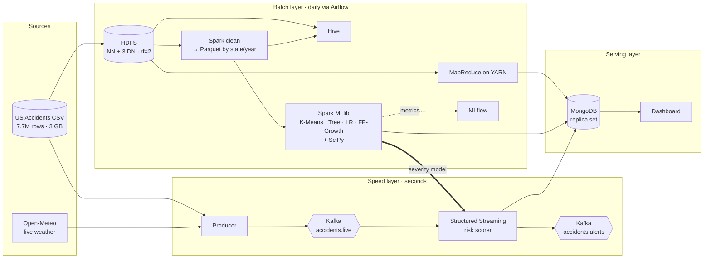
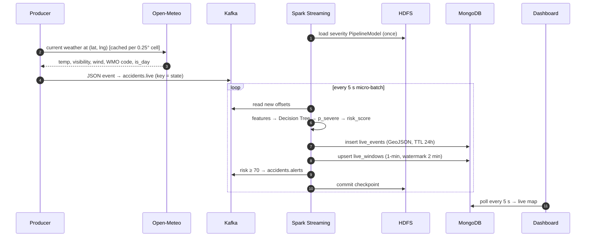
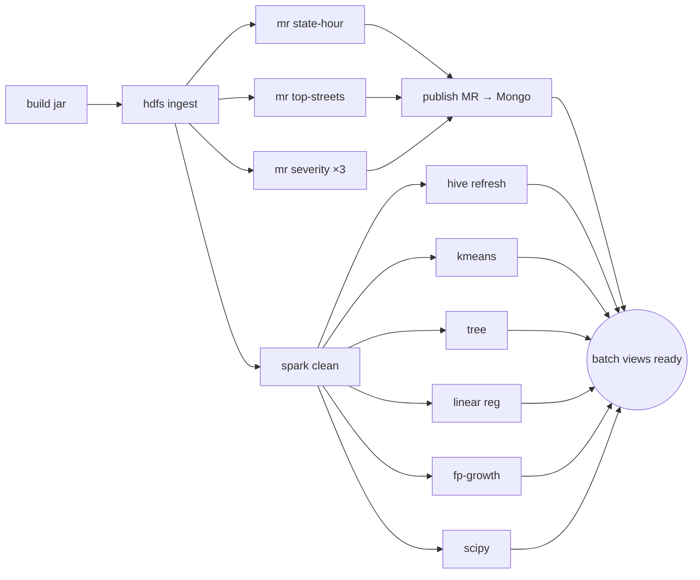

<div align="center">

# ARGUS

### Accident Risk Grid & Unified Streaming

**A Lambda-architecture big data platform for real-time road accident hotspot detection and severity prediction**

*Named after Argus Panoptes, the hundred-eyed giant who never slept.*

[](https://github.com/neevmodh/ARGUS/actions/workflows/ci.yml)


[Overview](#overview) •
[Architecture](#architecture) •
[Quick start](#quick-start) •
[Features](#what-argus-does) •
[Demos](#live-demos) •
[Syllabus map](#syllabus-coverage) •
[Full documentation](ARGUS_PROJECT_DOCUMENTATION.md)

</div>

---

## Overview

Accidents are rare individually but huge in aggregate: **7.7 million US accidents** from 2016 to 2023, 46 attributes each, about **3 GB** of raw CSV. ARGUS turns that history into answers to three questions, and then keeps answering them live:

| Question | How ARGUS answers it |
|---|---|
| **Where** do accidents cluster? | K-Means hotspots on GPS points, served through MongoDB geo queries |
| **When and why** do they turn severe? | Decision Tree severity model, FP-Growth rules, SciPy hypothesis tests |
| **What's the risk right now?** | Kafka → Spark Structured Streaming scores each live event within seconds, using current weather from Open-Meteo |

The whole system (Hadoop, YARN, MapReduce, Hive, Spark, MLlib, MLflow, Kafka, MongoDB, Airflow and a live dashboard) starts from **one `docker-compose.yml`**. It runs natively on Apple Silicon and x86.

<table>
<tr>
<td width="33%" valign="top">

**Batch layer**
- HDFS: 3 DataNodes, replication 2
- 3 Java MapReduce jobs on YARN
- Hive over CSV and partitioned Parquet
- 5 Spark ML / statistics jobs
- MLflow experiment tracking
- Airflow daily DAG

</td>
<td width="33%" valign="top">

**Speed layer**
- Kafka (KRaft, no ZooKeeper)
- Replay producer + live weather
- Structured Streaming scorer
- 1-minute windows + watermark
- High-risk alerts back to Kafka
- Checkpointed to HDFS

</td>
<td width="33%" valign="top">

**Serving layer**
- MongoDB 3-node replica set
- GeoJSON + 2dsphere + TTL indexes
- Streamlit + Pydeck 3D maps
- "Check my risk" tool
- Live cluster-health panel

</td>
</tr>
</table>

---

## Architecture



<details>
<summary><b>Real-time path: one event, start to finish</b></summary>


</details>

<details>
<summary><b>Airflow DAG: <code>argus_batch_layer</code></b></summary>


Each task runs in a throwaway container (`DockerOperator`). Airflow reaches Docker only through a restricted socket proxy.
</details>

---

## Quick start

> **You need:** Docker Desktop (8 GB memory for the core flow, about 12 GB for all services), `make`, `git`, and Python 3.10+.

```bash
git clone https://github.com/neevmodh/ARGUS.git && cd ARGUS

make sample       # 200k synthetic rows in the exact Kaggle schema (~80 MB, 1 second)
make build        # build project images (first run ~5-10 min)
make mr-build     # compile + unit-test the MapReduce jar
make up           # HDFS, YARN, Spark, MLflow, MongoDB, dashboard
make pipeline     # ingest → MapReduce → publish → Spark clean → 5 ML jobs
```

Open **http://localhost:8501**, then start the real-time layer:

```bash
make up-stream    # Kafka + Kafka UI
make stream       # Structured Streaming scorer (background)
make produce      # replay accidents with live Open-Meteo weather
```

<details>
<summary><b>Use the real 3 GB dataset</b></summary>

```bash
pip install kaggle                  # then save your token to ~/.kaggle/kaggle.json
make download                       # → data/raw/US_Accidents_March23.csv
make hdfs-put && make pipeline      # every target switches to the real file automatically
```
Or choose the file explicitly: `make hdfs-put DATA=data/raw/US_Accidents_March23.csv`.
</details>

<details>
<summary><b>Optional: Hive and Airflow</b></summary>

```bash
make up-hive && make hive-init && make hive-query   # SQL over HDFS
make up-airflow                                     # http://localhost:8082 (admin/admin)
```
</details>

<details>
<summary><b>Memory profiles: start only what you need</b></summary>

| Command | Starts | Estimated RAM |
|---|---|---|
| `make up-core` | HDFS (NN + 3 DN), YARN, JobHistory | ~3 GB |
| `make up` | + Spark, MLflow, MongoDB ×3, dashboard | ~7 GB |
| `make up-stream` | + Kafka, Kafka UI | +1 GB |
| `make up-hive` | + HiveServer2 | +1.5 GB |
| `make up-airflow` | + Airflow, socket proxy | +1.5 GB |
| `make up-all` | everything | ~12 GB |
</details>

### Web UIs

| Service | URL | | Service | URL |
|---|---|---|---|---|
| Dashboard | http://localhost:8501 | | Spark master | http://localhost:8090 |
| HDFS NameNode | http://localhost:9870 | | MLflow | http://localhost:5500 |
| YARN | http://localhost:8088 | | Kafka UI | http://localhost:8085 |
| JobHistory | http://localhost:19888 | | HiveServer2 | http://localhost:10002 |
| Airflow | http://localhost:8082 | | MongoDB | `localhost:27018` |

---

## What ARGUS does

### MapReduce (Java, `mapreduce/`)
| Job | Shows these concepts | Output |
|---|---|---|
| `state-hour` | Combiner, **custom `Partitioner`** (a state's 24 hours go to one reducer), counters | Accidents per state × hour |
| `severity-stats` | **Custom `Writable`** (count, severity sum, severe count), the same class as combiner and reducer, `-Dargus.groupBy=weather\|state\|city\|hour` | Count, average severity, severe ratio |
| `top-streets` | **Two chained jobs**, `SequenceFile` output → input, in-mapper top-N, single reducer | Top 25 most dangerous streets |

```bash
hadoop jar argus-mr.jar severity-stats -Dargus.groupBy=weather /argus/raw/accidents /argus/mr/severity_by_weather
```

### Spark ML (`jobs/ml/`)
| Algorithm | Task | Techniques |
|---|---|---|
| **K-Means** | Accident hotspots from GPS points | Choose k by silhouette score + elbow on a sample; risk index; GeoJSON output |
| **Decision Tree** | Predict severity 1–4 | Inverse-frequency class weights, `TrainValidationSplit` tuning, per-class recall, confusion matrix, feature importance |
| **Linear Regression** | Tomorrow's accidents per city | Missing days filled with 0, lag and rolling-average window features, **time-based** split, compared with a naive baseline |
| **FP-Growth** | Conditions that precede severe accidents | Condition baskets, rules with consequent `sev=High`, ranked by lift |
| **SciPy** | Statistical evidence | χ² + Cramér's V, Spearman ρ, Kruskal–Wallis, relative risk with a 95% CI |

The **same feature pipeline** is used for training and live scoring, so the streaming model sees exactly what it was trained on.

### Speed layer (`streaming/`, `jobs/streaming/`)
- The **producer** re-stamps historical rows to *now*, converts to each accident's local timezone, and overlays **live Open-Meteo weather** (cached, falling back to historical weather on errors).
- **Structured Streaming** runs 3 concurrent queries:

| Query | Operation | Sink |
|---|---|---|
| `live_events` | Score every event with the Decision Tree | MongoDB via `foreachBatch` |
| `live_windows` | 1-min tumbling windows per state, **2-min watermark**, update mode | MongoDB upserts |
| `alerts` | Keep events with `risk_score ≥ 70` | Kafka `accidents.alerts` |

### Serving and dashboard (`mongodb/`, `dashboard/`)

| Tab | What you see |
|---|---|
| **Live** | 3D map of events coloured by risk, 5-minute stats, windowed per-state chart, top live risks (refreshes every 5 s) |
| **Hotspots** | 3D column map of K-Means clusters, top hotspots, MapReduce top streets |
| **Check my risk** | Pick a place and hour, get a score combining `$geoNear` hotspots × live-weather relative risk × hour-of-day factor |
| **Insights** | Model metrics, feature importance, association rules, forecasts, state × hour heatmap, hypothesis tests |
| **Cluster health** | Replica-set PRIMARY and SECONDARY members, HDFS live and dead DataNodes, under-replicated blocks (refreshes every 3 s) |

---

## Live demos

These run as single commands and are useful during the presentation.

| Command | What happens | Concept |
|---|---|---|
| `make demo-hdfs` | Stops a DataNode. The file stays readable, and the under-replicated block count drops to **0** as HDFS re-replicates | Replication, heartbeats, self-healing |
| `make demo-mongo` | Stops the MongoDB **primary** while a client writes with `w:majority`. Measures election time, the longest write gap, and **lost writes (expected 0)** | **CAP**: consistency over availability |
| `make benchmark` | The same aggregation on **MapReduce, Hive, Spark RDD, DataFrame, SQL and Parquet**, saved as `results/benchmark.png` | Engine and file-format trade-offs |
| `make mongo-crud` | Every BSON type, full CRUD, aggregation, `$near`, and `explain()` showing COLLSCAN → IXSCAN | MongoDB fundamentals |
| `make conventional` | SQLite and pandas on one machine, extrapolated to 7.7M rows | Why big data tools exist |

> Keep the dashboard's **Cluster health** tab open during `demo-hdfs` and `demo-mongo`, so everyone can watch the failure and recovery live.

A 10-minute presentation flow and viva answers are in [`docs/DEMO.md`](docs/DEMO.md).

---

## Syllabus coverage

| Unit | Topic | Where |
|:-:|---|---|
| **I** | Big data definition, types, conventional-system challenges, platforms | `make conventional`, 5 Vs analysis in the [documentation](ARGUS_PROJECT_DOCUMENTATION.md#2-introduction) |
| **II** | Hadoop ecosystem, HDFS, YARN, RDBMS vs Hadoop | `docker/hadoop/`, `hive/`, `make demo-hdfs` |
| **III** | MapReduce anatomy, shuffle/sort, failures, scheduling, types and formats, features | `mapreduce/`: combiner, partitioner, Writable, SequenceFile, chaining, counters |
| **IV** | Spark RDD/DataFrame, PySpark, NumPy, SciPy, MLlib: regression, clustering, association rules, decision tree | `jobs/`, `make benchmark` |
| **V** | CAP, BASE, NoSQL types, MongoDB data types, CRUD | `mongodb/`, `make mongo-crud`, `make demo-mongo` |

---

## Tech stack

| Layer | Technology | Why this choice |
|---|---|---|
| Storage | **HDFS 3.4** (custom multi-arch image) | The official image is amd64-only; ours runs natively on ARM64 too |
| Resources | **YARN** | Shared scheduling for MapReduce jobs |
| Batch compute | **MapReduce (Java 11)**, **Spark 3.5** | Classic and modern engines, benchmarked side by side |
| SQL | **Hive 4** | Schema-on-read over CSV; partition pruning over Parquet |
| ML | **Spark MLlib**, **NumPy/SciPy** | Distributed training plus statistical tests on the driver |
| Tracking | **MLflow** | Parameters, metrics and artifacts for every run |
| Streaming | **Kafka 3.9 (KRaft)**, **Structured Streaming** | Durable, replayable log plus exactly-once micro-batches |
| NoSQL | **MongoDB 8 replica set** | Documents, GeoJSON, TTL, automatic failover |
| Orchestration | **Airflow 2.11** + socket proxy | A DAG with retries, parameters and isolated tasks |
| UI | **Streamlit, Pydeck, Altair** | 3D geo maps and live refresh in pure Python |
| External | **Open-Meteo** | Free live weather, no API key |
| Quality | **GitHub Actions, Ruff, pytest, JUnit 5** | Every push is linted, tested and validated |

---

## Project structure

```
ARGUS/
├── docker-compose.yml          21 services, 6 profiles
├── Makefile                    every step: make help
├── docker/                     hadoop (multi-arch) · spark · py images
├── mapreduce/                  Java jobs + JUnit (Maven)
├── hive/                       DDL + analytics / benchmark queries
├── src/argus/                  shared package: config, schema, weather, features, events
├── jobs/
│   ├── batch/                  CSV → partitioned Parquet
│   ├── ml/                     kmeans · decision tree · linear regression · fp-growth · scipy
│   ├── streaming/              Kafka → scorer → MongoDB + Kafka alerts
│   ├── publish/                MapReduce results → MongoDB
│   └── benchmark/              RDD vs DataFrame vs SQL vs Parquet
├── streaming/producer.py       Kafka replay + Open-Meteo
├── dashboard/app.py            Streamlit serving layer
├── mongodb/                    replica-set init · CRUD walkthrough
├── airflow/dags/               daily batch DAG
├── scripts/                    demos · benchmark · dataset tools
├── tests/                      pytest
└── docs/DEMO.md                presentation script + viva prep
```

<details>
<summary><b>All <code>make</code> targets</b></summary>

| Group | Targets |
|---|---|
| Setup | `help` `sample` `download` `build` |
| Cluster | `up-core` `up` `up-stream` `up-hive` `up-airflow` `up-all` `down` `clean` `ps` `urls` |
| Batch | `hdfs-put` `hdfs-ls` `mr-build` `mr` `publish-mr` `spark-clean` `ml` `pipeline` |
| Speed | `stream` `stream-logs` `stream-stop` `produce` `produce-historic` `alerts` |
| Hive / Mongo | `hive-init` `hive-query` `beeline` `mongo-crud` `mongo-shell` |
| Demos | `demo-hdfs` `demo-mongo` `benchmark` `conventional` |
| Quality | `test` |
</details>

---

## Engineering decisions

<details>
<summary><b>Why the design looks the way it does</b></summary>

| Decision | Reason |
|---|---|
| Lambda over Kappa | Model training needs full history; the speed layer only needs recent events |
| 3 DataNodes, replication 2 | With only 2 nodes, a failure leaves nowhere to re-replicate to |
| 64 MB blocks, 3 s heartbeat | Parallelism and failure detection are visible on lab-scale data |
| `SeverityWritable` carries sum + count | Averages of averages are wrong, so the combiner must be associative |
| Read CSV as strings, cast explicitly | Skips a full extra pass over 3 GB for schema inference |
| Native Spark expressions, no UDFs | Stays in the JVM; executors don't need Python packages |
| Distance and duration excluded from features | They are known only after the accident (label leakage) |
| Class weights | Severity 2 is about 80%; plain accuracy would reward always predicting "2" |
| Time-based split for forecasting | A random split would leak the future into training |
| One weather rulebook in Java and Python | MapReduce, Spark and the stream agree; tests pin both sides |
| TTL on live events | Speed-layer data expires after 24 h; history lives in the batch layer |
| Airflow → socket proxy | Tasks run isolated, and Airflow never gets the raw Docker socket |
| Synthetic generator with planted signal | CI and development run without the 3 GB download, and the models have something real to find |
</details>

---

## Testing

```bash
make test                 # pytest (27 tests) + Maven build with JUnit
ruff check .              # lint
```

CI runs on every push: **Python** (Ruff + pytest), **MapReduce** (Maven + JUnit) and **Compose** (validation across all profiles).

---

## Roadmap

- [x] Multi-node HDFS + YARN with fault-tolerance demo
- [x] MapReduce jobs with combiner, partitioner, custom Writable, chaining
- [x] Hive over CSV and partitioned Parquet
- [x] K-Means, Decision Tree, Linear Regression, FP-Growth, SciPy tests
- [x] Kafka + Structured Streaming with live weather
- [x] MongoDB replica set with CAP demo
- [x] Airflow orchestration, MLflow tracking, dashboard, CI
- [ ] Full-dataset results and benchmark chart in the report
- [ ] Gradient-boosted trees / Random Forest comparison
- [ ] H3 hexagon grid hotspots
- [ ] Indian accident dataset adaptation
- [ ] Alert delivery to Telegram / email

---

## Team

| Member | Area |
|---|---|
| _Member 1_ | Hadoop, HDFS, YARN, MapReduce, Hive |
| _Member 2_ | Kafka, producer, Structured Streaming |
| _Member 3_ | Spark, MLlib, MLflow, SciPy |
| _Member 4_ | MongoDB, dashboard, Airflow, documentation |

---

## Dataset and citation

**US Accidents (2016–2023)** by Sobhan Moosavi et al. [Kaggle](https://www.kaggle.com/datasets/sobhanmoosavi/us-accidents), licensed **CC BY-NC-SA 4.0**.

```bibtex
@article{moosavi2019countrywide,
  title   = {A Countrywide Traffic Accident Dataset},
  author  = {Moosavi, Sobhan and Samavatian, Mohammad Hossein and Parthasarathy, Srinivasan and Ramnath, Rajiv},
  journal = {arXiv preprint arXiv:1906.05409},
  year    = {2019}
}
@inproceedings{moosavi2019accident,
  title     = {Accident Risk Prediction based on Heterogeneous Sparse Data: New Dataset and Insights},
  author    = {Moosavi, Sobhan and Samavatian, Mohammad Hossein and Parthasarathy, Srinivasan and Teodorescu, Radu and Ramnath, Rajiv},
  booktitle = {Proceedings of the 27th ACM SIGSPATIAL International Conference on Advances in Geographic Information Systems},
  year      = {2019}
}
```

Rows produced by `make sample` are synthetic (IDs prefixed `S-`) and are for development only.

---

<div align="center">

**[Full project documentation →](ARGUS_PROJECT_DOCUMENTATION.md)**

Built for the Big Data Analytics course · Hadoop · MapReduce · Hive · Spark · Kafka · MongoDB

</div>
