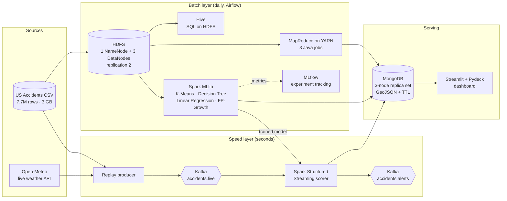

# ARGUS

**Accident Risk Grid & Unified Streaming**: a Lambda-architecture framework for real-time road accident hotspot detection and severity prediction using distributed big data technologies.

> *Argus Panoptes*, the hundred-eyed giant of Greek myth, never slept. ARGUS watches every road the same way: a **batch layer** learns from 7.7 million historical accidents, and a **speed layer** scores new events as they arrive.

[](https://github.com/neevmodh/ARGUS/actions/workflows/ci.yml)

---

## Architecture



## Syllabus coverage

| Unit | Topic | Where in ARGUS |
|---|---|---|
| **I** | Big data, 3 Vs, limits of conventional systems | `make conventional` times SQLite/pandas on the same file and extrapolates to 7.7M rows |
| **II** | Hadoop ecosystem, HDFS, YARN, RDBMS vs Hadoop | 5-daemon Hadoop cluster (`docker/hadoop`), Hive tables (`hive/`), `make demo-hdfs` (kill a DataNode, keep reading, watch re-replication) |
| **III** | MapReduce: anatomy, shuffle/sort, combiners, partitioners, types & formats, job chaining, counters | `mapreduce/`: custom `Writable`, custom `Partitioner`, combiner, `SequenceFile` I/O, 2-stage chained job, counters |
| **IV** | Spark RDDs, DataFrames, PySpark, NumPy/SciPy, MLlib: regression, clustering, association rules, decision trees | `jobs/ml/`: K-Means hotspots, weighted Decision Tree, Linear Regression forecasts, FP-Growth rules, SciPy tests; `jobs/benchmark/` compares RDD vs DataFrame vs SQL |
| **V** | NoSQL, CAP, BASE, MongoDB data types & CRUD | 3-node replica set, `make mongo-crud` (every BSON type, CRUD, aggregation, `$near`, `explain`), `make demo-mongo` (kill the primary under load) |

## Tech stack

| Component | Role | UI |
|---|---|---|
| Docker Compose | Whole cluster, profile-based startup | – |
| HDFS 3.4 (custom multi-arch image) | Distributed storage, 3 DataNodes | http://localhost:9870 |
| YARN + JobHistory | Resource management for MapReduce | http://localhost:8088 · :19888 |
| MapReduce (Java 11) | Batch aggregations | – |
| Hive 4 | SQL over HDFS (CSV + partitioned Parquet) | http://localhost:10002 |
| Spark 3.5 (standalone) | Cleaning, MLlib, Structured Streaming | http://localhost:8090 |
| MLflow 2.22 | Experiment tracking | http://localhost:5500 |
| Kafka 3.9 (KRaft) + Kafka UI | Event bus for the speed layer | http://localhost:8085 |
| MongoDB 8 replica set | Serving layer, geo queries | `localhost:27018` |
| Airflow 2.11 | Daily batch orchestration (DockerOperator) | http://localhost:8082 |
| Streamlit + Pydeck | Live 3D map dashboard | http://localhost:8501 |
| Open-Meteo | Free live weather API | – |
| GitHub Actions | Ruff, pytest, Maven tests, compose validation | – |

## Quick start

**Prerequisites:** Docker Desktop (8 GB memory for the core flow, about 12 GB for everything), `make`, and Python 3.10 or newer.

```bash
git clone https://github.com/neevmodh/ARGUS.git && cd ARGUS

make sample          # 200k synthetic rows in the real schema (or: make download for the 3 GB dataset)
make build           # build project images (first time: ~5-10 min)
make mr-build        # compile + unit-test the MapReduce jar
make up              # HDFS + YARN + Spark + MLflow + MongoDB + dashboard

make pipeline        # HDFS ingest -> MapReduce -> Spark clean -> 5 ML jobs -> MongoDB
```

Open the dashboard at http://localhost:8501. Then start the real-time layer:

```bash
make up-stream       # Kafka + Kafka UI
make stream          # Spark Structured Streaming scorer (background)
make produce         # replay accidents into Kafka with live Open-Meteo weather
```

Run `make help` to list every target.

### Using the real dataset
1. `pip install kaggle`, then save your API token to `~/.kaggle/kaggle.json`.
2. Run `make download`. It saves the file as `data/raw/US_Accidents_March23.csv`.
3. Run `make hdfs-put` and every later target. When the real file is present, all targets use it automatically.

## Live demos

| Command | What the examiner sees |
|---|---|
| `make demo-hdfs` | A DataNode is killed and the file stays readable. The under-replicated block count drops to 0 as HDFS heals itself. |
| `make demo-mongo` | The primary is killed while a client writes. A new primary is elected within seconds, writes pause briefly and resume, and none are lost (CAP: consistency chosen over availability). |
| `make benchmark` | The same aggregation runs on MapReduce, Hive, Spark RDD, DataFrame, SQL and Parquet, saved as `results/benchmark.png`. |
| `make mongo-crud` | Every BSON data type, CRUD, aggregation, geo queries, and `explain()` before and after an index. |
| Dashboard → *Cluster health* | Live DataNode and replica-set state, useful while running the two demos above. |

A 10-minute presentation script and likely viva questions are in [docs/DEMO.md](docs/DEMO.md).

## Repository layout

```
ARGUS/
├── docker-compose.yml        # all services, grouped into profiles
├── Makefile                  # every workflow step (make help)
├── docker/                   # hadoop (multi-arch), spark, py images
├── mapreduce/                # Java MapReduce jobs + JUnit tests
├── hive/                     # DDL + analytics queries
├── jobs/
│   ├── batch/                # raw CSV -> curated Parquet
│   ├── ml/                   # kmeans, decision tree, linear regression, fp-growth, scipy stats
│   ├── publish/              # MapReduce output -> MongoDB
│   ├── streaming/            # Kafka -> Structured Streaming -> MongoDB/Kafka
│   └── benchmark/            # Spark engine comparison
├── src/argus/                # shared Python package (config, schema, features, weather)
├── streaming/producer.py     # Kafka replay producer + Open-Meteo
├── dashboard/app.py          # Streamlit serving layer
├── mongodb/                  # replica-set init, CRUD demo
├── airflow/dags/             # daily batch DAG
├── scripts/                  # demos, benchmark, dataset tools
└── tests/                    # pytest
```

## Design decisions

- **Lambda architecture.** The batch layer builds accurate views (models, hotspots and statistics) over all history. The speed layer gives low-latency scores. MongoDB serves both.
- **3 DataNodes with replication 2.** With only 2 nodes, losing one leaves nowhere to copy blocks to. A third node makes self-healing visible in the demo.
- **No label leakage.** `Distance(mi)` and accident duration describe what happens *after* an accident, so they are excluded from the severity features.
- **Class weights.** Severity 2 makes up about 80% of the data. Without inverse-frequency weights, the tree would predict "2" every time and still look 80% accurate.
- **Time-based split for forecasting.** A random split would leak future information into training.
- **Shared weather buckets.** The same ordered rules exist in Python (`src/argus/weather.py`) and Java (`WeatherBucket.java`), with tests on both sides, so MapReduce, Spark and the live stream agree.
- **Custom Hadoop image.** The official `apache/hadoop` image is amd64-only, so ours builds on `eclipse-temurin` and runs natively on Apple Silicon and x86.
- **Airflow isolation.** Airflow reaches Docker through a restricted socket proxy, not the raw Docker socket.

## Suggested team split

| Member | Area |
|---|---|
| 1 | Hadoop, HDFS, YARN, MapReduce, Hive (Units II–III) |
| 2 | Kafka, Structured Streaming, producer (speed layer) |
| 3 | Spark MLlib, MLflow, SciPy (Unit IV) |
| 4 | MongoDB, dashboard, Airflow (Unit V + serving) |

## Dataset

Moosavi, S., Samavatian, M. H., Parthasarathy, S., & Ramnath, R. *A Countrywide Traffic Accident Dataset* (2019), and *Accident Risk Prediction based on Heterogeneous Sparse Data* (ACM SIGSPATIAL 2019). [Kaggle: US Accidents (2016–2023)](https://www.kaggle.com/datasets/sobhanmoosavi/us-accidents), licensed CC BY-NC-SA 4.0. Synthetic rows from `make sample` are prefixed `S-` and are for development only.
